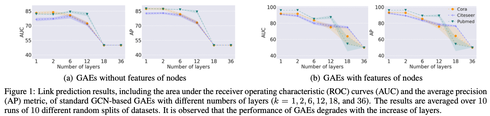
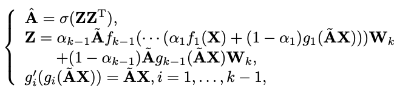
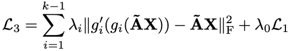
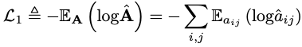
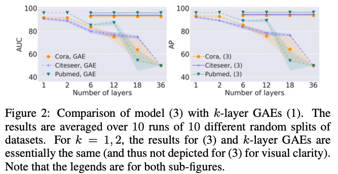
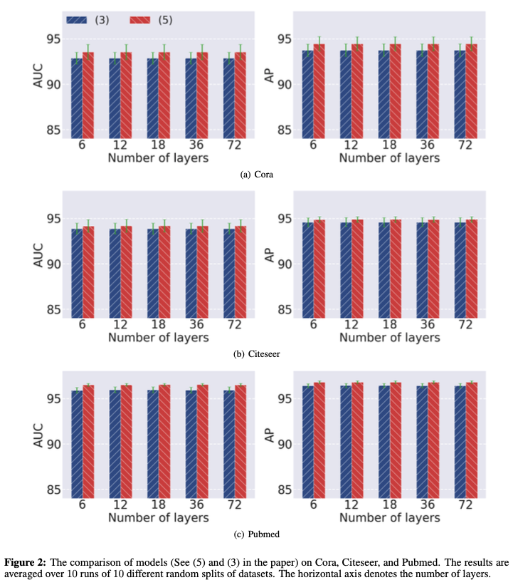
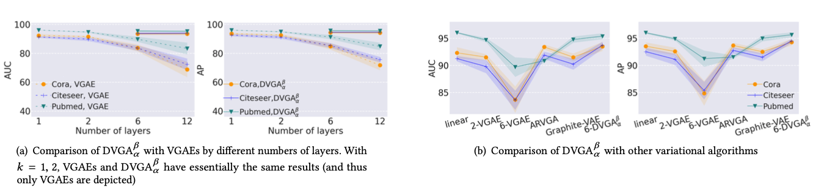
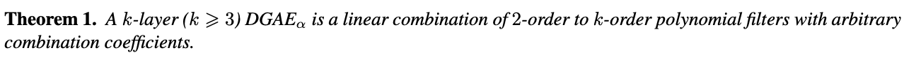
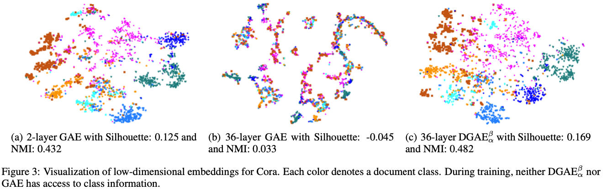
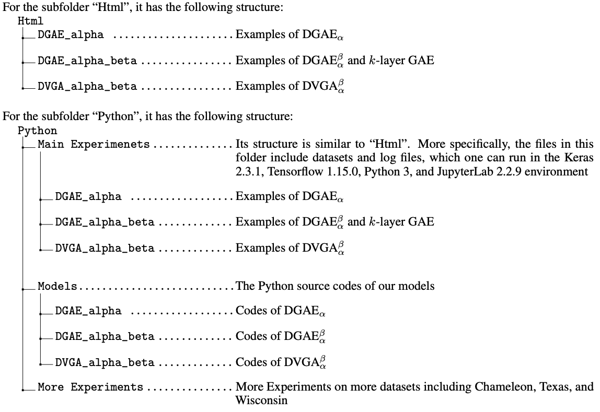

# Stabilizing and Enhancing Link Prediction through Deepened Graph Auto-Encoders
---
The performance of GAEs degrades with the increase of layers:

---

## Model

Our main model (i.e. Model (5)) is as follows:

The loss function is as follows:

Where

The performance of our proposed models compared to the orignal models:

---

## Main Theoretical Result

---

## Visulization

---

## Codes

The main codes for our proposed models, including DGAE$_{\alpha}$, DGAE$_{\alpha}^{\beta}$, and DVGA$_{\alpha}^{\beta}$ in our paper " Codes of Stabilizing and Enhancing Link Prediction through Deepened Graph Auto-Encoders". The files in the subfolder "Python", are the Python source codes, which have been implemented in JupyterLab. For readability, we also provide the html files in the subfolder "Html".

---

## How to Cite

Xinxing Wu, Qiang Cheng. Deepened Graph Auto-Encoders Help Stabilize and Enhance Link Prediction. The 31st International Joint Conference on Artificial Intelligence and the 25th European Conference on Artificial Intelligence (IJCAI-ECAI 2022). 2022.

---
  
## Release History

* 0.0.1
    * Codes published

---

---

## License

Distributed under the MIT license. See [``LICENSE``](https://github.com/xinxingwu-uk/DGAE/blob/main/LICENSE) for more information.

---

## Contacts

Xinxing Wu (xinxingwu@gmail.com) and Qiang Cheng (qiang.cheng@uky.edu)
